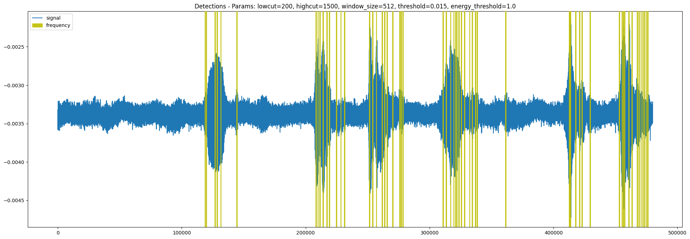
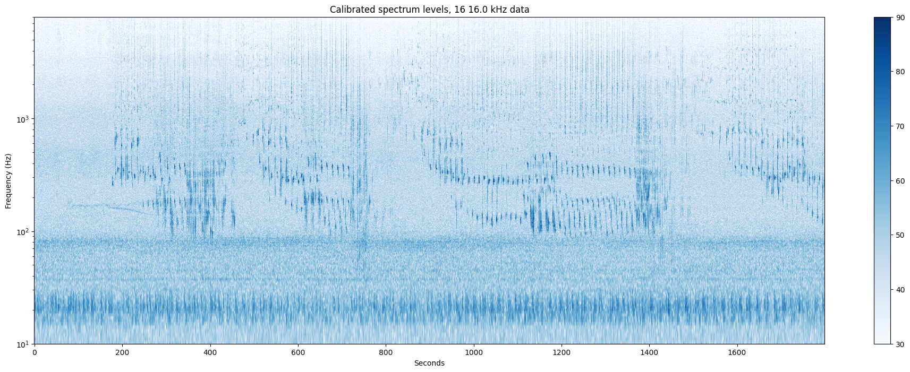
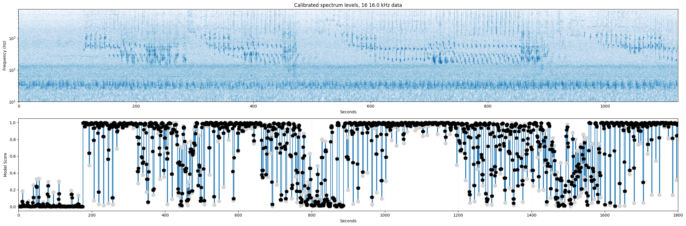

# Lightweight Detection Mechanisms

This doc's purpose is to consider the different options for simple whale vocalization detection mechanisms.
The chosen mechanism will sift through the large audio data, to find the most interesting parts to feed into the machine learning model.

## Background
The main goal of this pipeline to is efficiently detect vocalizations from whales encountered on [HappyWhale](https://happywhale.com/). 
Since audio data is notoriously large, we want to quickly find which chunks of audio are most important to look at, before classifying them via the [humpback_whale model](https://tfhub.dev/google/humpback_whale/1).

Initially, the data that does not make it past the filter will not be fed through the machine learning model, in order to keep costs down. 
This means, we need a filtering mechanism that is "generuous" in what it flags, but not too generous that it flags everything.

I'm still learning about different options, so this doc will be updated as I learn more.

## Options

### Energy filter
Simplest of filters. Just measures peaks in audio signal, above a specified threshold.
We would need to normalize then threshold the audio signal to detect peaks.
Could also do a root mean square (RMS) over a short window to detect high energy sections. 

#### Pros
- very lightweight
- easy to implement

#### Cons
- too much noise will make it through
- not very specific
- prioritizes loudness over frequency
- sounds from a distance will likely not be detected
- too rudiementary alone, but good to combine w/ frequency filters for example

### [Butterworth Passband Filter](https://en.wikipedia.org/wiki/Butterworth_filter)

Filters out audio that does not contain a certain frequency range.
Only allows a particular band of frequencies to pass through. 
These are determined via the filter's order and cutoff frequencies, low and high.
The order of the filter determines how steep the roll-off is, i.e. how "boxy" the filter is.
The higher the order, the steeper the roll-off, and the sharper the corners of the top of the filter.

For our use case, we want to find audio with frequencies matching expected whale vocalization frequencies. 
If the audio over a specified time window contains frequencies inside of the band, it is flagged as a detection.

To get this most out of this type of filter, we would likely need to use a handful of them, each focusing on their own frequency range.

#### Pros 
- more specific than energy filter
- can be tuned to specific frequencies, i.e. a specific species
- lightweight
- fast (~6 s to computer for 30 min)
- easy to implement
- can be used together w/ other filtering methods

#### Cons
- fixed window size (needs to be tuned)
- assumes a certain frequency range is the most important 
    - disregards harmonics
    - clicks may not be detected
    - different ages/individuals may have different frequency ranges (?)
- not great at detecting vocalizations from a distance

### [Chebyshev Passband Filter](https://en.wikipedia.org/wiki/Chebyshev_filter)
Slightly more complex than the Butterworth filter, but with a steeper roll-off.
The Chebyshev filter has a ripple in the passband, which can be tuned to be more or less aggressive. 
It can also handle removing specific frequencies in the stopband, for example a ship's engine noise.

#### Pros
- more specific than Butterworth
- can be tuned to specific frequencies
- can be used together w/ other filtering methods
- can remove specific frequencies

#### Cons
- more computationally expensive than Butterworth (I don't think it is by too much though. Need to test)
- more difficult to interpret
- no experience with it
- ...

### [Spectrogram](https://en.wikipedia.org/wiki/Spectrogram)
A [short-time Fourier transform](https://en.wikipedia.org/wiki/Short-time_Fourier_transform), which visualizes the frequencies of a signal as it varies with time.
This is a 3D representation of the audio signal, where the x-axis is time, y-axis is frequency, and color is energy of that frequency.

 

#### Pros
- can be used to detect harmonics
- can be used to detect clicks
- can be used to detect sounds from a distance
- can be used to detect multiple species
- can be calibrated to find specific frequencies
- energy threshold can be applied to find exact time-range of matching frequencies
    - might need to be dynamic to adjust for different distances
- visually intuitive

#### Cons
- slightly more computationally expensive (still less than model)

### Distilled Student-Teacher model
We could set up a lightweight NN classifier 
that is trained from classifications.

True positives would be time-frames that the 
Google humpback model finds classifications in. 
False positives are then detections time-frames with 
low scoring pooled model confidence outputs. 
False negatives are when the model found whales, 
but the detection filter didn't. 
True negatives are when both methods don't find 
any whale prescence, i.e. most of the time. 

#### Pros 
- can be calibrated
    - window size
    - margin size
    - confidence threshold
    - etc
- student may find the most obvious signs of whale

#### Negative
- requires training
- requires parallel classifications of same audio -> "expensive"
- many variables/ hyperparameters to tune 

### Humpback Whale Model
Final option is to just directly use the model on the data surronding a encounter. 
This is the most expensive option, but also the most accurate.

#### Pros
- most accurate
- "smartest" filter

#### Cons
- computationally expensive
- slowest

## Decision
In my brainstorming notebook, I used the Butterworth Bandpass Filter, since it was the simplest filter of a cert
The pipeline should maybe be built to allow for easy swapping of filters via the config file, which will enable easier experimentation at some later time. 
From this, I'll gather results, and see if going straight to model would be better. 
This doc will be updated with the results of the experiment.
